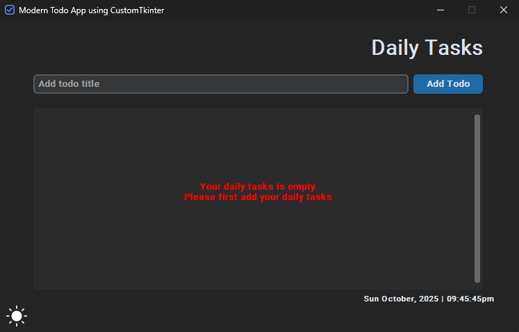
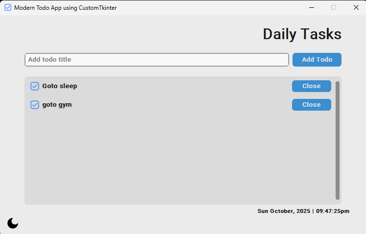
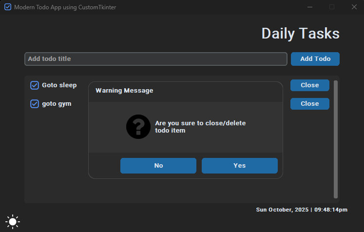

# ✅ CTk Modern To-Do App

A **modern, elegant, and fully functional To-Do List Application** built using **Python**, **CustomTkinter** and **SQLite3**.  
It features a beautiful GUI with persistent data storage — perfect for managing daily tasks efficiently.


## 🌟 Overview

The **Modern To-Do App** is designed with simplicity and productivity in mind. Built using **CustomTkinter**, it brings a sleek and modern interface while keeping your tasks safe in a local **SQLite3 database** — so they’re always available when you reopen the app.

This project is ideal for learning GUI design, CRUD operations and database integration in Python.


## 📌 Technologies Used

### **Tkinter**
Tkinter is Python’s standard GUI library used for building cross-platform desktop applications.

### **CustomTkinter**
[CustomTkinter](https://github.com/TomSchimansky/CustomTkinter) extends Tkinter with:

- Modern, consistent design  
- Light & Dark themes  
- High-DPI scaling  
- Fully customizable modern widgets  

Together, they ensure a smooth UI experience on **Windows**, **macOS**, and **Linux**.

| Component | Description |
|------------|--------------|
| **Language** | Python 3.x |
| **GUI Framework** | CustomTkinter |
| **Database** | SQLite3 |
| **Core Libraries** | Tkinter, CustomTkinter, SQLite3 |

## ⚙️ Features

- 📝 Add, edit and delete tasks  
- ✅ Mark tasks as complete or pending  
- 💾 Auto-save tasks to SQLite3 database  
- 🌙 Modern dark/light theme using CustomTkinter  
- 🔍 Filter and search tasks  
- 🪶 Lightweight, responsive, and minimal design  
- 💻 Cross-platform support (Windows, macOS, Linux)


## 🧰 Installation Steps

### Step 1. Clone the repository

```bash
git clone https://github.com/iamx-ariful-islam/CTk-Modern-Todo-App.git
cd CTk-Modern-Todo-App
```

### Step 2. Install Python Dependencies

The `requirements.txt` file, lists of all the Python libraries that "**_ctk modern todo app_**" depends on and installs those packages from the file:

```bash
pip install -r requirements.txt
# or (Linux/MacOS)
sudo pip install -r requirements.txt
```

### Step3. Run the Application
```bash
python main.py
```


## 📂 Folder Structure
Here’s the structure of the **CTk Modern Todo App** project:

```bash
CTk-Modern-Todo-App/
│
├── database/
├── icons/
├── screenshots/
├── backend.py
├── ctkmessagebox.py
├── ctktooltip.py
├── main.py
│── LICENSE
├── README.md
└── requirments.txt
```


## 🖼️ Screenshots

Here are some screenshots of the `CTk Modern Todo App` project:

**Main Window**<br/>
<br/>
**Output - Main Window**<br/>
<br/>
**Warning - Main Window**<br/>



## 🤝 Contributing

Contributions, suggestions, and feedback are always welcome! ❤️<br/>
To contribute:

1. Fork the repository
2. Create a new branch (`feature/new-feature`)
3. Commit your changes
4. Push and submit a Pull Request

💬 You can also open an issue if you’d like to discuss a feature or report a bug.


## 🌐 For more or connect with me

<p align='center'>
  <a href="https://github.com/iamx-ariful-islam"></a>&nbsp;&nbsp;
  <a href="https://bd.linkedin.com/in/iamx-ariful-islam"></a>&nbsp;&nbsp;
  <a href="https://x.com/mx_ariful_islam"></a>&nbsp;&nbsp;
  <a href="https://www.facebook.com/iamx.ariful.islam/"></a>
</p>


## 📜 License

The [MIT](https://choosealicense.com/licenses/mit/) License (MIT)


## 💖 Thank You for Visiting!

> “Good design is about making things simple yet significant”  
> — *Md. Ariful Islam*